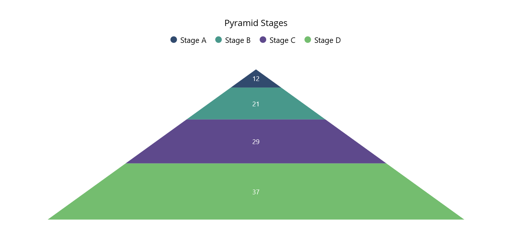

# Getting Started with .NET MAUI Chart(SfPyramidChart)

## Creating an application using the .NET MAUI chart(SfPyramidChart)

1. Create a new .NET MAUI application in Visual Studio.
2. Syncfusion .NET MAUI components are available in [nuget.org](https://www.nuget.org/). To add SfPyramidChart to your project, open the NuGet package manager in Visual Studio, search for Syncfusion.Maui.Charts and then install it.
3. To initialize the control, import the Chart namespace.
4. Initialize [SfPyramidChart]().

**[XAML]**
```
<ContentPage   
    . . .
    xmlns:chart="clr-namespace:Syncfusion.Maui.Charts;assembly=Syncfusion.Maui.Charts">

    <chart:SfPyramidChart/>
</ContentPage>
```

**[C#]**
```
using Syncfusion.Maui.Charts;
. . .

public partial class MainWindow : ContentPage
{
    public MainPage()
    {
        this.InitializeComponent();
        SfPyramidChart chart = new SfPyramidChart();
    }
}   
```

## Register the handler

Syncfusion.Maui.Core Nuget is a dependent package for all Syncfusion controls of .NET MAUI. In the MauiProgram.cs file, register the handler for Syncfusion core.

**[C#]**
```
using Microsoft.Maui;
using Microsoft.Maui.Hosting;
using Microsoft.Maui.Controls.Compatibility;
using Microsoft.Maui.Controls.Hosting;
using Microsoft.Maui.Controls.Xaml;
using Syncfusion.Maui.Core.Hosting;

namespace ChartGettingStarted
{
    public static class MauiProgram
    {
        public static MauiApp CreateMauiApp()
        {
            var builder = MauiApp.CreateBuilder();
            builder
            .UseMauiApp<App>()
            .ConfigureSyncfusionCore()
            .ConfigureFonts(fonts =>
            {
                fonts.AddFont("OpenSans-Regular.ttf", "OpenSansRegular");
            });

            return builder.Build();
        }
    }
}
```

## Initialize view model

Now, let us define a simple data model that represents a data point in the chart.

**[C#]**
```
 public class Stage
{
    public string Name { get; set; }
    public double Value { get; set; }
}
```

Next, create a view model class and initialize a list of `Model` objects as follows.

**[C#]**
```
public class ChartViewModel
{
    public List<Stage> Data { get; set; }

    public ChartViewModel()
    {
        Data = new List<Stage>()
        {
            new Stage(){Name = "Stage A", Value = 12},
            new Stage(){Name = "Stage B", Value = 21},
            new Stage(){Name = "Stage C", Value = 29},
            new Stage(){Name = "Stage D", Value = 37},
        };
    }
}
```

Create a `ViewModel` instance and set it as the chart's `BindingContext`. This enables property binding from `ViewModel` class.

> **_Note:_**
Add the namespace of `ViewModel` class to your XAML Page, if you prefer to set `BindingContext` in XAML.

**[XAML]**
```
<ContentPage
    . . .
    xmlns:chart="clr-namespace:Syncfusion.Maui.Charts;assembly=Syncfusion.Maui.Charts"
    xmlns:model="clr-namespace:ChartGettingStarted">

    <chart:SfPyramidChart>
        <chart:SfPyramidChart.BindingContext>
        <model:ChartViewModel/>
        </chart:SfPyramidChart.BindingContext>
    </chart:SfPyramidChart>
</ContentPage>
```

**[C#]**
```
ChartViewModel viewModel = new ChartViewModel();
chart.BindingContext = viewModel;
```

## Populate chart with data

 Binding `Data` to the pyramid chart [ItemsSource]() property from its BindingContext to create our own pyramid chart.

**[XAML]**
```
<chart:SfPyramidChart ItemsSource="{Binding Data}" 
                      XBindingPath="Name" 
                      YBindingPath="Value"/>
. . .            
</chart:SfPyramidChart>
```

**[C#]**
```
SfPyramidChart chart = new SfPyramidChart();
ChartViewModel viewModel = new ChartViewModel();
chart.BindingContext = viewModel;
chart.ItemsSource = viewModel.Data;
chart.XBindingPath = "Name";
chart.YBindingPath = "Value";
this.Content = chart;
```

## Add a title

The title of the chart acts as the title to provide quick information to the user about the data being plotted in the chart. You can set the title using the [Title](https://help.syncfusion.com/cr/maui/Syncfusion.Maui.Charts.ChartBase.html#Syncfusion_Maui_Charts_ChartBase_Title) property of the pyramid chart as follows.

**[XAML]**
```
<chart:SfPyramidChart>
    <chart:SfPyramidChart.Title>
        <Label Text="Pyramid Stages"/>
    </chart:SfPyramidChart.Title>
    . . .
</chart:SfPyramidChart>
```

**[C#]**
```
SfPyramidChart chart = new SfPyramidChart();
chart.Title = new Label
{
    Text = "Pyramid Stages"
};
``` 

## Enable the data labels

The [ShowDataLabels]() property of the chart can be used to enable data labels to improve the readability of the pyramid chart. The label visibility is set to `False` by default.

**[XAML]**
```
<chart:SfPyramidChart ShowDataLabels="True">
    . . .
</chart:SfPyramidChart>
```

**[C#]**
```
SfPyramidChart chart = new SfPyramidChart();
. . .
chart.ShowDataLabels = true;
```

## Enable a legend

The legend provides information about the data point displayed in the pyramid chart. The [Legend](https://help.syncfusion.com/cr/maui/Syncfusion.Maui.Charts.ChartBase.html#Syncfusion_Maui_Charts_ChartBase_Legend) property of the chart was used to enable it.

**[XAML]**
```
<chart:SfPyramidChart>
    . . .
    <chart:SfPyramidChart.Legend>
    <chart:ChartLegend/>
    </chart:SfPyramidChart.Legend>
</chart:SfPyramidChart>
```

**[C#]**
```
SfPyramidChart chart = new SfPyramidChart();
. . .
chart.Legend = new ChartLegend();
```

## Enable Tooltip

Tooltips are used to show information about the segment, when mouse over on it. Enable tooltip by setting the chart [EnableTooltip]() property as true.

**[XAML]**
```
<chart:SfPyramidChart EnableTooltip="True">
    . . .
</chart:SfPyramidChart>
```

**[C#]**
```
SfPyramidChart chart = new SfPyramidChart();
. . .
chart.EnableTooltip = true;
```

The following code example gives you the complete code of above configurations.

**[XAML]**
```
<chart:SfPyramidChart ItemsSource="{Binding Data}" 
                      ShowDataLabels="True" 
                      EnableTooltip="True"
                      XBindingPath="Name"         
                      YBindingPath="Value">
    <chart:SfPyramidChart.Title>
        <Label Text="Pyramid Stages"/>
    </chart:SfPyramidChart.Title>
    <chart:SfPyramidChart.BindingContext>
        <model:ChartViewModel/>
    </chart:SfPyramidChart.BindingContext>
    <chart:SfPyramidChart.Legend>
        <chart:ChartLegend/>
    </chart:SfPyramidChart.Legend>
</chart:SfPyramidChart>
```

**[C#]**
```
using Syncfusion.Maui.Charts;
. . .
public partial class MainPage : ContentPage
{   
    public MainWindow()
    {
        SfPyramidChart chart = new SfPyramidChart();
        chart.Title = new Label
        {
            Text = "Pyramid Stages"
        };
        chart.Legend = new ChartLegend();
        ChartViewModel viewModel = new ChartViewModel();
        chart.BindingContext = viewModel;

        chart.ItemsSource = viewModel.Data;
        chart.XBindingPath = "Name";
        chart.YBindingPath = "Value";
        chart.EnableTooltip = true;
        chart.ShowDataLabels = true;
        this.Content = chart;
    }
}
```


